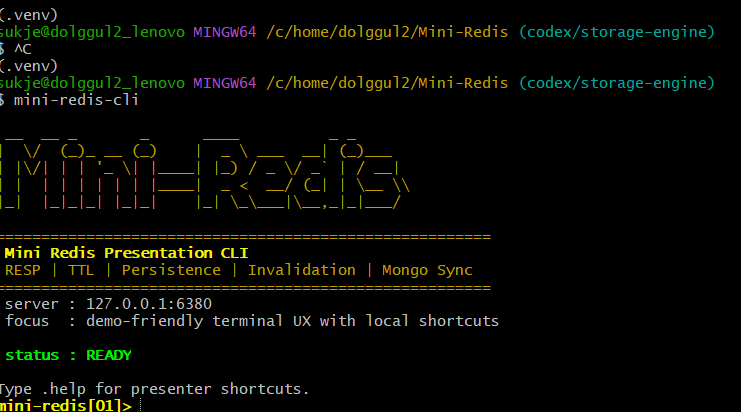
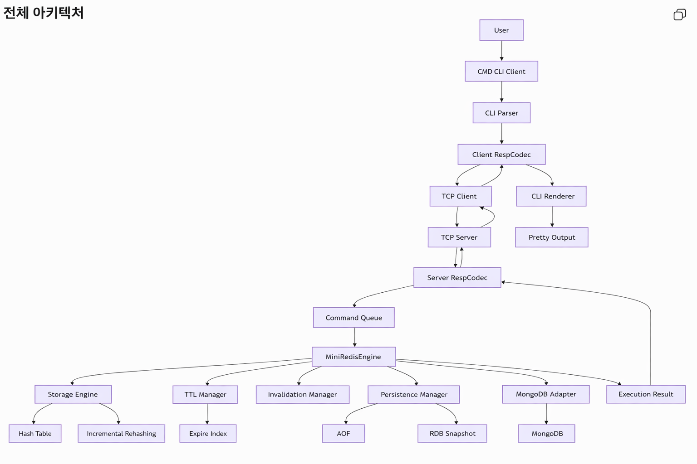

<p align="center">
  
</p>

# Mini Redis

Mini Redis는 Redis의 핵심 동작을 Python으로 재구성한 미니 서버 프로젝트입니다.
기본적인 Key-Value 저장소를 넘어 RESP 프로토콜, TCP 통신, TTL, 태그 기반 invalidation,
AOF/RDB 스타일 persistence, 복구 정책, storage inspection과 benchmarking까지 포함해
서버 내부 구조를 계층적으로 구현했습니다.

## Actual Screen

아래 화면은 Mini Redis 서버에 연결된 CLI 메인 화면입니다.



이 화면에서 바로 다음 작업을 수행할 수 있습니다.

- `PING`, `SET`, `GET`, `TTL`, `FLUSHDB` 같은 Redis 스타일 명령 실행
- `INSPECT STORAGE`를 통한 storage 상태 확인
- `INSPECT STORAGE RUN <count>`로 삽입 요청을 자동 생성하고 rehash/latency 관찰
- `INSPECT STORAGE UPDATE <count>`로 수정 요청을 보내며 resizing 종료 여부 확인
- `SAVE`, `LOAD`, `INFO PERSISTENCE`로 persistence와 recovery 흐름 점검

즉 이 CLI는 단순한 명령 입력창이 아니라, Mini Redis 내부 동작을 시연하고 설명하는 실험 인터페이스 역할도 함께 합니다.

## 1. Overview

### 목표

- Redis의 핵심 동작을 직접 구현하며 내부 구조를 이해한다.
- CLI, Network, Protocol, Command Routing, Engine, Storage를 분리된 계층으로 설계한다.
- 단순 CRUD를 넘어서 TTL, persistence, recovery, diagnostics까지 포함한 서버를 만든다.

### 핵심 키워드

- `Server / Client`
- `RESP`
- `TCP Server / Client`
- `Command Queue`
- `CommandManager`
- `Storage Engine`
- `TTL`
- `Tag-based Invalidation`
- `AOF / Snapshot`
- `Recovery Policy`
- `Incremental Rehashing`
- `MongoDB Manager`

## 2. Features At A Glance

| 구분 | 구현 내용 |
| --- | --- |
| Client UX | `mini-redis-cli`, ASCII 배너, 응답 포맷팅, timing 표시 |
| Protocol | RESP 인코딩/디코딩, 멀티라인 프레임 처리 |
| Network | TCP 서버/클라이언트 구현, 서버는 지속 연결 처리, 기본 CLI 클라이언트는 명령마다 새 연결 사용 |
| Command Layer | 명령 정규화, FIFO 실행, 핸들러 기반 라우팅 |
| Core Data | `SET`, `GET`, `MGET`, `DELETE`, `EXISTS`, `INCR`, `KEYS`, `DUMPALL` |
| Expiration | `EXPIRE`, `TTL`, 만료 key 정리 |
| Invalidation | `TAGS`, `INVALIDATE <tag>` |
| Persistence | `SAVE`, `LOAD`, `BGSAVE`, `REWRITEAOF`, `BGREWRITEAOF`, `REPAIRAOF`, `FLUSHDB` |
| Diagnostics | `INSPECT STORAGE`, `PROBE`, storage 상태/latency/rehash 진행도 관찰 |
| Benchmark | `BENCHMARK REDIS|MONGO|HYBRID` |
| Runtime Config | `CONFIG GET`, `CONFIG SET` |
| Observability | `INFO PERSISTENCE`, `INFO MONGO` |
| Testing | CLI, RESP, TCP, Storage, TTL, Persistence, Recovery, Diagnostics, Mongo 경계 테스트 |

## 3. Distinctive Features

이 프로젝트의 특징은 Redis 명령을 흉내내는 데서 끝나지 않고, 내부 동작과 운영 상태를
관찰할 수 있는 기능들을 함께 구현했다는 점입니다.

| 기능 | 설명 |
| --- | --- |
| Tag-based Invalidation | `SET ... TAGS ...` 와 `INVALIDATE <tag>` 로 관련 key를 묶어서 제거할 수 있습니다. |
| Observable Persistence | `INFO PERSISTENCE` 로 snapshot, AOF, metadata, background task 상태를 확인할 수 있습니다. |
| Recovery Policies | `best-effort`, `snapshot-first`, `aof-only`, `strict` 복구 정책을 지원합니다. |
| Repairable AOF | `REPAIRAOF` 로 손상된 AOF tail을 복구할 수 있습니다. |
| FIFO Command Queue | `CommandManager`가 동시 요청을 FIFO 순서로 직렬 실행합니다. |
| Incremental Rehash Storage | 내부 해시 테이블이 incremental rehashing 방식으로 동작합니다. |
| Storage Inspection | `INSPECT STORAGE`, `PROBE` 로 rehash 진행도와 요청 latency를 관찰할 수 있습니다. |
| Benchmark Modes | `BENCHMARK REDIS`, `BENCHMARK MONGO`, `BENCHMARK HYBRID` 로 백엔드별 쓰기 비용을 비교할 수 있습니다. |
| Debug-friendly Dump | `DUMPALL` 이 key, value, ttl, tags를 함께 보여줍니다. |
| CLI Local Helpers | `.help`, `.demo`, `.clear`, `.exit`, `WATCH`, `LIVESET` 같은 로컬 helper를 제공합니다. |

## 4. Architecture



## 5. Presentation Materials

### 5-1. 서버 - 클라이언트

- 클라이언트는 사용자의 명령을 입력받아 RESP 형식으로 인코딩한 뒤 TCP로 서버에 전송합니다.
- 서버는 RESP 요청을 해석하고 `CommandManager`에 전달한 뒤, 실행 결과를 다시 RESP 응답으로 반환합니다.
- 네트워크 계층은 transport 역할만 담당하고, 실제 명령 실행은 상위 계층에 위임합니다.

### 5-2. 커맨드 큐

- 여러 요청이 동시에 들어와도 `CommandQueue`가 모든 명령을 FIFO 순서로 직렬 실행합니다.
- storage, ttl, invalidation, persistence 같은 공유 상태를 안전하게 관리하기 위한 구조입니다.
- throughput보다 데이터 정합성과 예측 가능한 실행 순서를 우선합니다.

### 5-3. 커맨드 매니저

- `CommandManager`는 서버 명령의 단일 진입점입니다.
- 들어온 명령을 정규화하고 적절한 handler로 라우팅합니다.
- 모든 명령이 동일한 경로를 통과하기 때문에 테스트, 디버깅, 로깅, 복구 흐름을 일관되게 유지할 수 있습니다.

### 5-4. Storage Engine (Hash Table, Incremental Rehashing)

- 메인 저장소는 in-memory hash table 기반의 key-value store입니다.
- load factor가 임계치를 넘으면 더 큰 테이블을 만들고, 각 요청마다 bucket을 조금씩 옮기는 incremental rehashing으로 확장합니다.
- resize 비용을 한 번에 몰지 않고 분산시켜 응답 지연을 줄이는 것이 핵심입니다.
- `INSPECT STORAGE`, `PROBE` 를 통해 rehash 진행 상태와 latency를 관찰할 수 있습니다.

### 5-5. TTL Manager

- key의 만료 시각을 별도 구조로 관리합니다.
- `EXPIRE` 로 TTL을 설정하고 `TTL` 로 남은 시간을 조회합니다.
- 조회 전에 만료 여부를 확인해 expired key를 자동 정리합니다.
- 값 저장과 만료 정책을 분리해 책임을 명확하게 나눴습니다.

### 5-6. Invalidation Manager

- tag 기반 secondary index를 관리합니다.
- `SET ... TAGS ...` 로 key와 tag를 연결하고, `INVALIDATE <tag>` 로 관련 key를 한 번에 제거합니다.
- key 삭제, 만료, 복구 시 tag index도 함께 정리해 stale reference를 방지합니다.
- 여러 key를 하나의 그룹처럼 관리할 수 있도록 만든 캐시 무효화 계층입니다.

### 5-7. Persistence Manager

- 메모리 상태를 파일로 저장하고 재시작 후 복구하는 계층입니다.
- AOF는 명령 로그를 순차적으로 기록하고, snapshot은 현재 상태를 한 번에 저장합니다.
- 부팅 시 recovery policy에 따라 snapshot을 복원하고, snapshot 이후의 AOF tail을 replay합니다.
- `SAVE`, `BGSAVE`, `REWRITEAOF`, `REPAIRAOF`, `INFO PERSISTENCE` 등으로 persistence 상태를 관리합니다.

### 5-8. MongoDB Manager

- MongoDB 연동을 위한 확장 경계 계층입니다.
- 연결 정보, upsert/delete/clear, `INFO MONGO`, `BENCHMARK MONGO`, `BENCHMARK HYBRID` 를 제공합니다.
- 현재는 기본 Redis 명령 경로에서 자동 write-through 하지는 않으며, 외부 저장소 확장 포인트로 설계되어 있습니다.

## 6. Usage Examples

### 기본 명령

```text
PING
SET user:1 hello
GET user:1
INCR visits
MGET user:1 visits missing:key
```

### TTL + Tags

```text
SET user:1:profile profile TAGS user:1 demo
SET user:1:session live EX 30 TAGS user:1 demo
TTL user:1:session
DUMPALL
```

### Storage Inspection

```text
FLUSHDB
INSPECT STORAGE RESET
INSPECT STORAGE RUN 20
INSPECT STORAGE
INSPECT STORAGE UPDATE 20
INSPECT STORAGE FULL
```

### Single Request Probe

```text
PROBE SET demo:key hello
PROBE UPDATE demo:key hello-again
```

### Benchmark

```text
BENCHMARK REDIS 1000 KEEP
BENCHMARK MONGO 1000
BENCHMARK HYBRID 1000
```

### Persistence

```text
SAVE
INFO PERSISTENCE
CONFIG SET autorewrite_min_operations 1
SET auto:key value
INFO PERSISTENCE
```

## 7. Supported Server Commands

```text
PING
HELP [command]
SET <key> <value> [EX <seconds>] [TAGS <tag> ...]
GET <key>
MGET <key> [key ...]
DELETE <key>
EXISTS <key>
INCR <key>
KEYS
DUMPALL
EXPIRE <key> <seconds>
TTL <key>
INVALIDATE <tag>
INSPECT STORAGE
INSPECT STORAGE FULL
INSPECT STORAGE RESET
INSPECT STORAGE RUN <count>
INSPECT STORAGE UPDATE <count>
PROBE SET <key> <value>
PROBE UPDATE <key> <value>
BENCHMARK REDIS|MONGO|HYBRID <count> [KEEP]
SAVE
BGSAVE
LOAD
REWRITEAOF
BGREWRITEAOF
REPAIRAOF
FLUSHDB
INFO PERSISTENCE
INFO MONGO
CONFIG GET <key>
CONFIG SET <key> <value>
QUIT
```

## 8. CLI Local Commands

다음 명령은 서버로 보내지지 않고 CLI 내부에서 처리됩니다.

| Command | Description |
| --- | --- |
| `.help` | 로컬 helper 목록을 출력합니다. |
| `.demo` | 추천 시연 시퀀스를 출력합니다. |
| `.clear` | 화면을 정리합니다. |
| `.exit` | 서버에 `QUIT`를 보내지 않고 CLI만 종료합니다. |
| `WATCH <interval> <count> <command...>` | 중첩 명령을 주기적으로 반복 실행합니다. |
| `LIVESET <count> [interval] [key_prefix]` | 연속적인 `PROBE SET` 요청을 자동 생성합니다. |

## 9. Testing

현재 테스트 범위:

- CLI parser / CLI output / WATCH / LIVESET
- RESP codec
- TCP round-trip / multiline RESP / persistent server connection
- FIFO command execution
- incremental rehash storage
- TTL
- command flow
- inspect / probe / benchmark
- persistence / restore / repair
- Mongo integration boundary

총 65개의 테스트 케이스가 존재합니다.

## 10. Current Limits

- Mongo 관련 모듈과 `INFO MONGO`는 구현되어 있습니다.
- `BENCHMARK MONGO`, `BENCHMARK HYBRID` 는 Mongo integration이 활성화되어 있어야 동작합니다.
- 하지만 현재 기본 Redis command flow에서 `SET`/`DELETE`가 자동으로 Mongo write-through 되지는 않습니다.
- 따라서 Mongo는 현재 기준으로는 확장 가능한 연동 경계로 보는 것이 가장 정확합니다.

## 11. Run

### Windows PowerShell

```powershell
python -m venv .venv
.venv\Scripts\Activate.ps1
pip install -e ".[dev]"
mini-redis-server
```

다른 터미널에서:

```powershell
.venv\Scripts\Activate.ps1
mini-redis-cli
```

### macOS / Linux

```bash
python3 -m venv .venv
source .venv/bin/activate
pip install -e ".[dev]"
mini-redis-server
```

다른 터미널에서:

```bash
source .venv/bin/activate
mini-redis-cli
```

## 12. Data Files

실행 중 생성될 수 있는 파일:

- `data/appendonly.aof`
- `data/dump.rdb.json`
- `data/persistence.meta.json`
